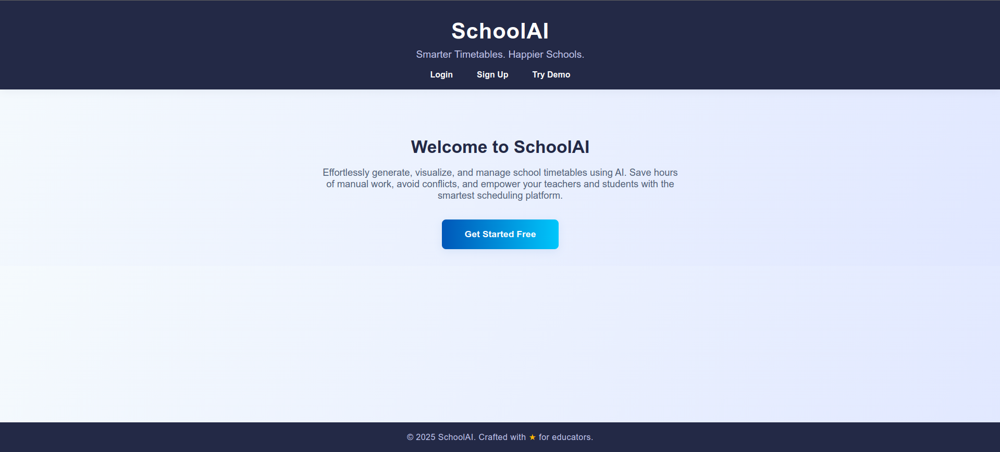
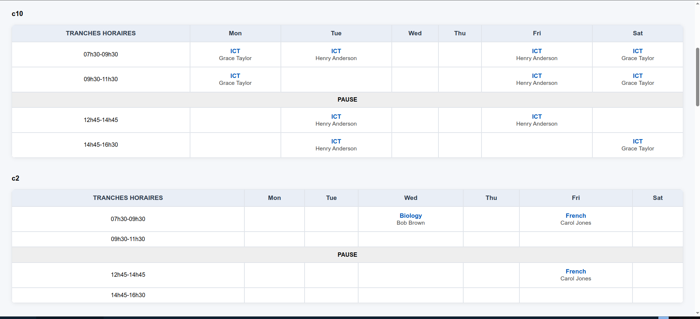
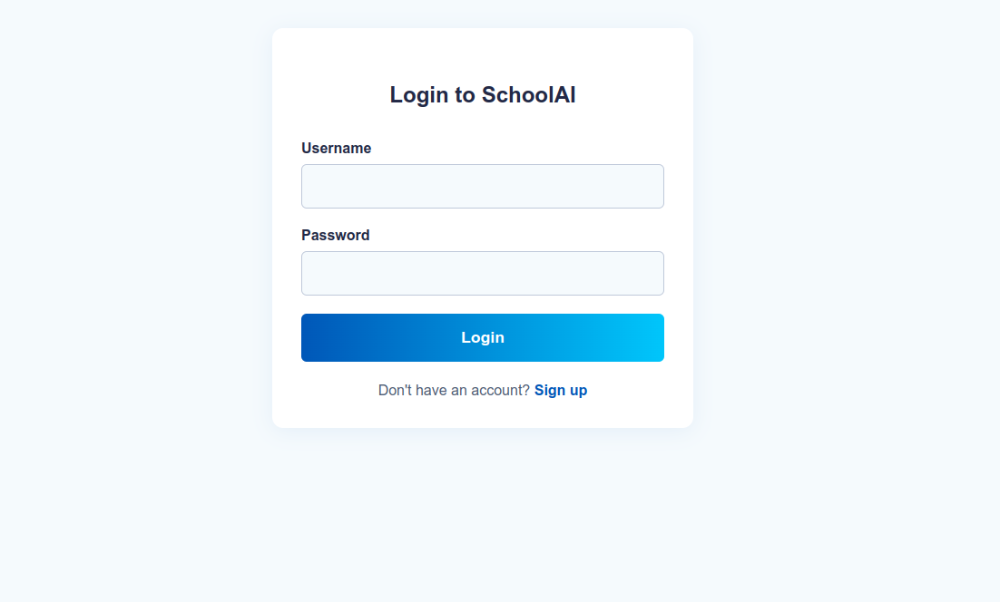
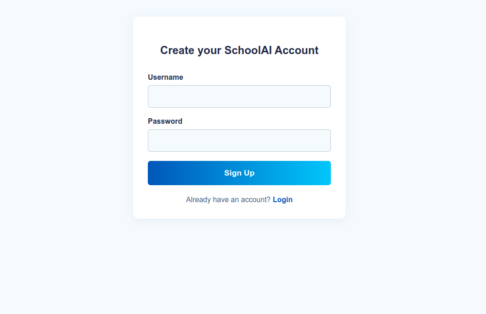

# SchoolAI: Smarter Timetables for Modern Schools


> **Effortlessly generate, visualize, and manage school timetables using AI.**

---

## 🚀 Overview
SchoolAI is a Django + MongoDB web platform that leverages AI (Constraint Satisfaction with Google OR-Tools) to automate and optimize school timetable creation. No more manual scheduling, conflicts, or wasted hours—just smart, beautiful schedules for teachers and students.

---

## ✨ Features
- **AI Timetable Generation:** Automatic, conflict-free scheduling using CSP and OR-Tools.
- **Modern UI:** Interactive, responsive timetable display for all classes.
- **Realistic Data Seeder:** Populate your DB with demo classes, teachers, and subjects.
- **User Authentication:** Sign up, login, and secure your scheduling portal.
- **Beautiful Landing Page:** Professional first impression for your school or district.
- **REST API:** Easily extend or integrate with other systems.

---

## 🛠️ Tech Stack
- **Backend:** Django, Django REST Framework, mongoengine (MongoDB)
- **AI Engine:** Google OR-Tools (CSP)
- **Frontend:** HTML5, CSS3, vanilla JS (templated with Django)
- **Database:** MongoDB

---

## ⚡ Quickstart

### 1. Clone the repo
```bash
git clone https://github.com/yourusername/schoolai.git
cd schoolai
```

### 2. Install dependencies
```bash
python -m venv venv
source venv/bin/activate
pip install -r requirements.txt
```

### 3. Configure MongoDB
- Ensure MongoDB is running locally (`localhost:27017`).
- Edit `settings.py` if you need to change DB settings.

### 4. Seed demo data
```bash
python manage.py shell < scheduler/seed.py
```

### 5. Run the server
```bash
python manage.py runserver
```

### 6. Open in your browser
- Landing page: [http://localhost:8000/](http://localhost:8000/)
- Timetable demo: [http://localhost:8000/scheduler/test-timetable/](http://localhost:8000/scheduler/test-timetable/)

---

## 🖥️ Screenshots
> _Add your screenshots here!_
- 
- 
- 
- 

---

## 🧩 Project Structure
```
schoolai/
├── scheduler/
│   ├── templates/
│   ├── engine.py
│   ├── seed.py
│   ├── views.py
│   ├── models.py
│   └── ...
├── schoolai/
│   └── settings.py
├── manage.py
└── requirements.txt
```

---

## 🙌 Credits
- **AI Engine:** [Google OR-Tools](https://developers.google.com/optimization/)
- **Web Framework:** [Django](https://www.djangoproject.com/)
- **MongoDB ORM:** [mongoengine](https://mongoengine.org/)
- **Frontend:** [Django Templates](https://docs.djangoproject.com/en/stable/topics/templates/)

---

## 📄 License
MIT License. Feel free to use, modify, and contribute!

---

## 💡 Future Improvements
- Export timetables (PDF, Excel)
- Teacher/student portals
- Advanced constraint editing
- Notifications & integrations

---

> _Built with ❤️ for educators and schools everywhere._
